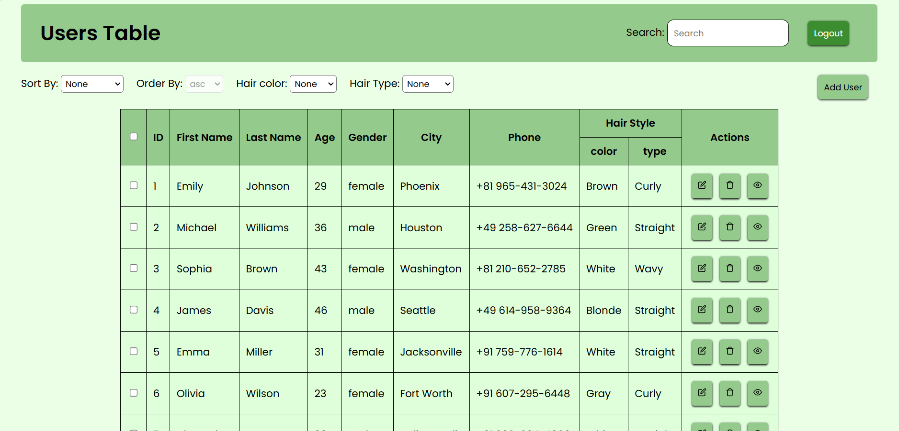
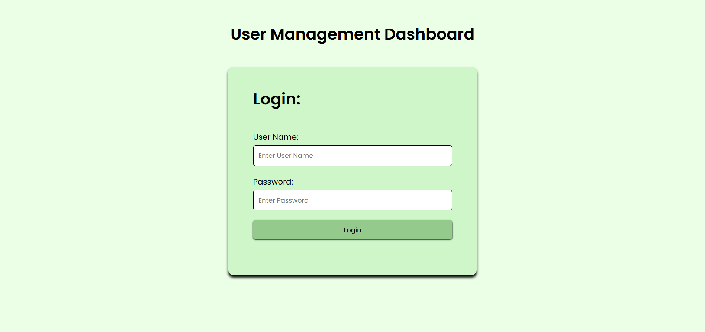
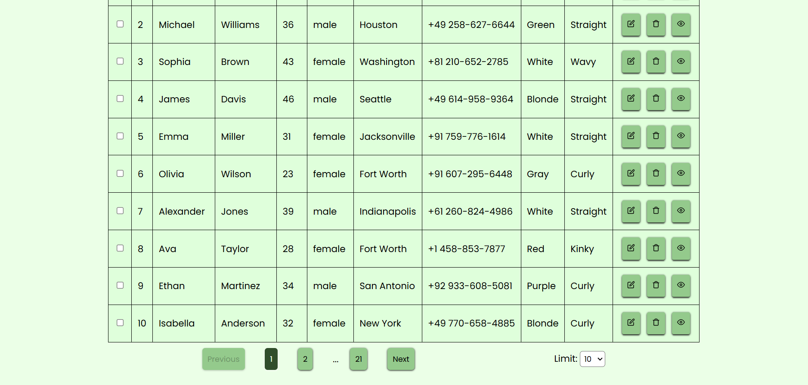
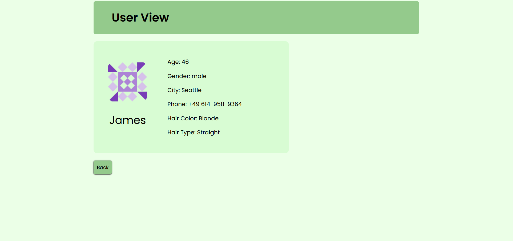
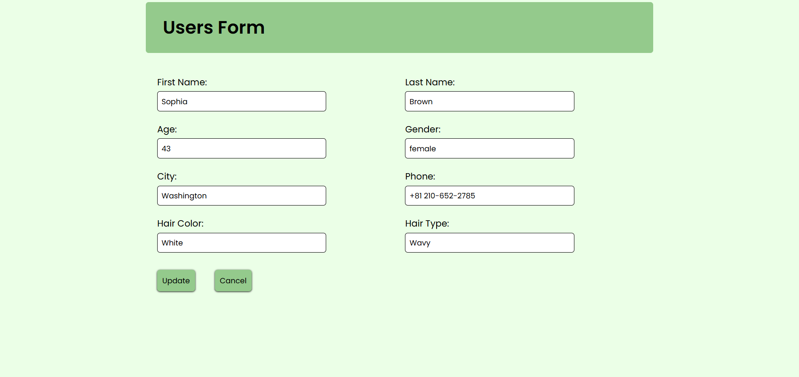

# User Management Dashboard

A modern React-based User Management Dashboard that allows users to authenticate, manage user records, perform CRUD operations, search, filter, paginate, and manage multiple users efficiently. This project consumes the DummyJSON REST API to simulate a real-world admin dashboard.

---

## 📖 Overview

This project was built to practice building a real-world React application similar to an Admin Dashboard used by companies.

The application includes authentication, protected routes, user management, search, filtering, pagination, bulk actions, and responsive layouts while interacting with REST APIs.

Although the backend is provided by DummyJSON, the complete frontend application, routing, state management, UI, and API integration were developed using React.

---

## ✨ Features

### Authentication
- Login using DummyJSON API
- Protected Routes
- Logout functionality
- Session persistence using Local Storage

### User Management
- View all users
- Add new users
- Edit existing users
- Delete individual users
- View complete user details
- Bulk select users
- Delete multiple selected users

### Search & Filters
- Search users by name
- Filter users
- Dynamic filtering options

### Pagination
- Previous / Next navigation
- Dynamic page size selection
- Current page indicator

### User Interface
- Clean dashboard layout
- Responsive design
- Loading states
- Reusable React components
- Easy navigation

---

## 🛠️ Built With

- React.js
- JavaScript (ES6+)
- HTML5
- CSS3
- React Router DOM
- Fetch API
- DummyJSON REST API
- Vite

---

## 🔑 Test Login Credentials

DummyJSON provides demo credentials.

### Username

```
emilys
```

### Password

```
emilyspass
```

## 🌐 API Used

DummyJSON

https://dummyjson.com/users

Endpoints used include:

- Login
- Get Users
- Add User
- Update User
- Delete User

---

## 📸 Screenshots

### Dashboard



---

### Login



---

### Pagination



---

### User Details



---

### Edit and Add User



---

## 📚 What I Learned

While building this project, I gained hands-on experience with:

- React Hooks
- Component-based architecture
- React Router
- REST API Integration
- Authentication
- Protected Routes
- CRUD Operations
- State Management
- Search & Filtering
- Pagination
- Conditional Rendering
- Form Handling
- Local Storage
- Responsive UI Development

---

## 🚀 Future Improvements

- Backend with Node.js & Express
- Database Integration
- JWT Authentication
- User Roles & Permissions
- Sorting
- Dark Mode
- Toast Notifications
- Form Validation
- Unit Testing

---

## 👨‍💻 Author

**Ruchit Kumar**

LinkedIn:
https://linkedin.com/in/ruchit-cs

GitHub:
https://github.com/ruchitkumar1093
